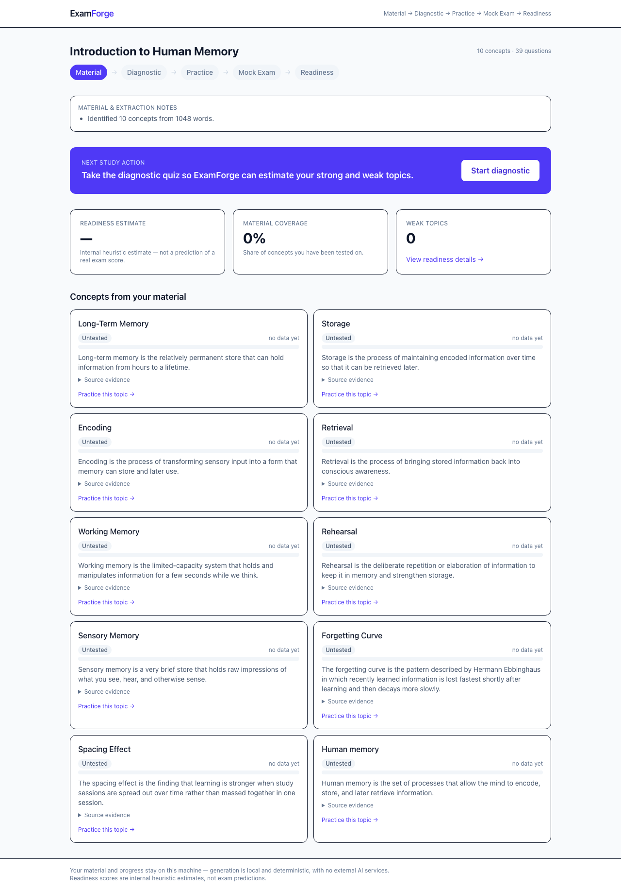
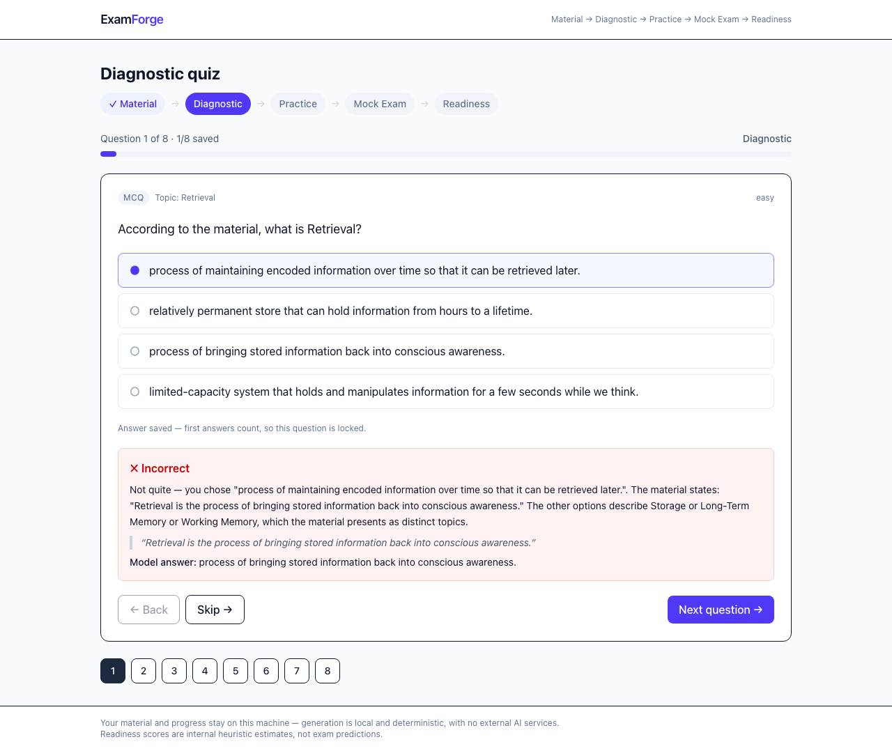

# ExamForge

**Turn study material into an adaptive exam coach.**

ExamForge takes study material (Markdown, pasted text, or a text-based PDF), extracts the
key concepts, diagnoses what you actually know with a short diagnostic quiz, gives grounded
feedback on every answer, trains your weak topics, runs a mock exam, and tells you what to
study next.

It is deliberately **not** a "chat with your PDF" app. The core loop is active recall:

> Material → Diagnostic → Practice → Mock Exam → Readiness



## Quick start

Requires Node.js **22.13+** (local persistence uses the built-in `node:sqlite` module,
enabled without flags from Node 22.13; the repo pins this via `engines` and `.nvmrc`).

```bash
npm install
npm run dev            # http://127.0.0.1:3000 (loopback only)
```

The dev and production servers bind to `127.0.0.1` by default, so your study material and
progress stay on your machine and the app is not reachable from other devices on your
network. To expose it deliberately (not recommended for private material), override the
host in the underlying command.

No API key needed. Click **“Load bundled demo material”** on the home page and you get a
full course ("Introduction to Human Memory", 10 concepts, ~40 questions) generated
deterministically on your machine.

Try it end-to-end: take the diagnostic → see weak topics → practice one → take the mock
exam → check the readiness dashboard. Your progress persists locally in SQLite
(`.data/examforge.sqlite`).

## What you get (no setup, no network)

| Step | What happens |
| --- | --- |
| **Material** | Load the bundled sample, paste text/Markdown, or upload a text-based PDF. |
| **Concepts** | Deterministic extraction finds the key topics with quotes from your material as evidence. |
| **Diagnostic** | Up to 8 questions, one per major concept, mixed types (MCQ, true/false, short answer). |
| **Feedback** | Every answer gets consistent grading plus an explanation grounded in the source, with the quote. |
| **Weak topics** | A simple, explainable mastery model (recency-weighted) sorts concepts into weak / developing / strong. |
| **Practice** | Targeted sets for one topic — including open explanation questions graded by key-idea coverage. |
| **Mock exam** | Balanced across concepts, feedback withheld until you submit, full review afterward. |
| **Readiness** | An internal heuristic estimate (clearly labeled — not an exam-score prediction) and an ordered study plan. |



## Supported material

- ✅ Bundled sample (one click)
- ✅ Pasted text / Markdown (headings + "X is …" definitions work best)
- ✅ Text-based PDFs
- ⚠️ Scanned PDFs need OCR — not supported; ExamForge tells you honestly when extraction
  comes up empty
- ❌ Slides with heavy layouts may extract poorly (quality notes appear when they do)

## Scripts

```bash
npm run dev              # dev server on 127.0.0.1:3000
npm run build            # production build
npm start                # run the production build
npm test                 # unit + integration tests (vitest)
npm run test:e2e         # Playwright journey test (own loopback server, disposable DB)
npm run test:smoke:prod  # production build + smoke test on an isolated server
npm run typecheck        # tsc --noEmit
npm run lint             # eslint
npm run db:reset         # delete local progress data
npm run screenshots      # regenerate the README screenshots (run `npm run build` first)
```

Browser tests never touch your local course data: `test:e2e` and `test:smoke:prod` start
their own server on a dedicated port with a disposable SQLite database in a temp
directory. `npm run screenshots` is isolated the same way — it captures from its own
loopback server with a fresh temporary database, so published screenshots can only ever
show the bundled demo material and never your own courses.

## Privacy

- Generation is local and deterministic: your material is never sent to an external AI
  service, and no API key or external generation service exists in the current app.
- Servers bind to loopback (`127.0.0.1`) by default in both `npm run dev` and `npm start`,
  so material and progress remain local to ExamForge's process/storage during normal use.
- Deleting a course removes its material, concepts, questions, and progress.
- Readiness/mastery numbers are internal study heuristics, not predictions.

## Limitations

- Generation is pattern-based: material without clear definition sentences yields fewer
  questions (it will not invent filler).
- Readiness is a heuristic over this app's answers only — it is not a real exam prediction.
- No OCR, no multi-user accounts (single local learner), no scheduling beyond simple
  review hints.

See [PRODUCT.md](PRODUCT.md) for the product contract and [ARCHITECTURE.md](ARCHITECTURE.md)
for the technical design and system invariants.
